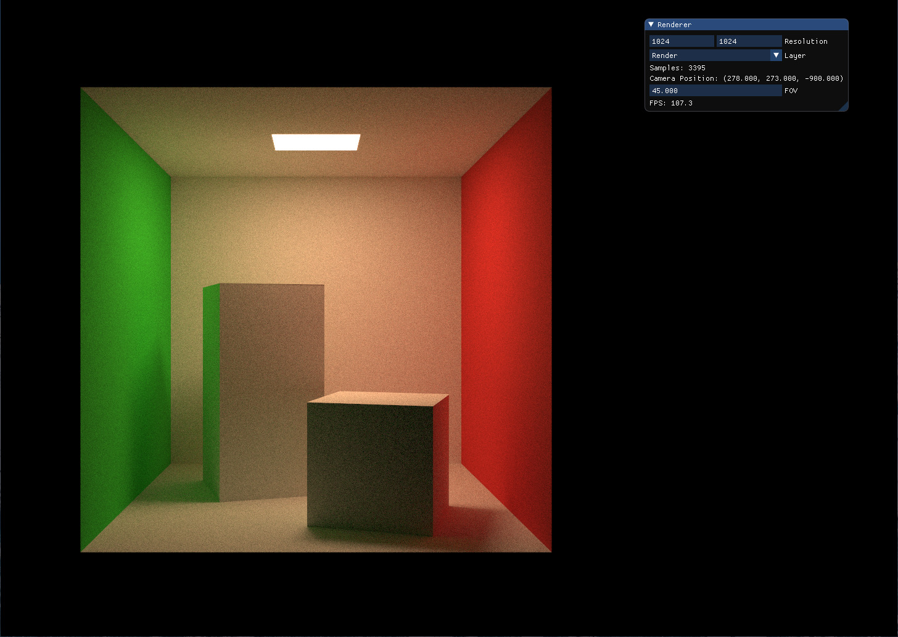

# glsl330-cornellbox

Render Cornell Box with Path Tracing in GLSL(version 330 core).



## Features

* Unidirectional Path Tracing
* Path Tracing with Next Event Estimation
* Lambert, Mirror, Glass Material
* Interactive GUI

## Requirements

* C++17
* OpenGL 3.3
* CMake 3.12 or Higher

## Setup

```bash
git submodule update --init
```

## Build

```bash
mkdir build
cd build
cmake ..
make
```

## Externals

* [GLFW](https://github.com/glfw/glfw) - Zlib License
* [glad](https://github.com/Dav1dde/glad) - Public Domain, WTFPL or CC0
* [glm](https://github.com/g-truc/glm) - The Happy Bunny License or MIT License
* [GLSL Shader Includes](https://github.com/tntmeijs/GLSL-Shader-Includes) - MIT License
